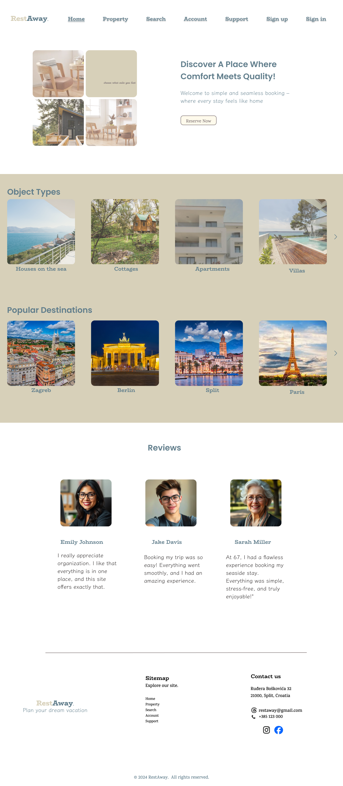

# Low/High Fidelity Prototype

## Introduction

This assignment involves using Figma to design a low or high-fidelity prototype for the landing/home page of our web application. We applied fundamental design principles such as consistency, readability, and visual hierarchy to create an aesthetically pleasing and user-friendly interface.

We have uploaded pictures of our high-fidelity prototypes to the repository, along with a README file.

## High Fidelity Prototype 

### Desktop Verison

High-fidelity prototype for desktop include advanced design elements and mimic the final user experience.

    

### Mobile verison 

High-fidelity prototype include detailed design and interactivity, closely resembling the final product.

    

